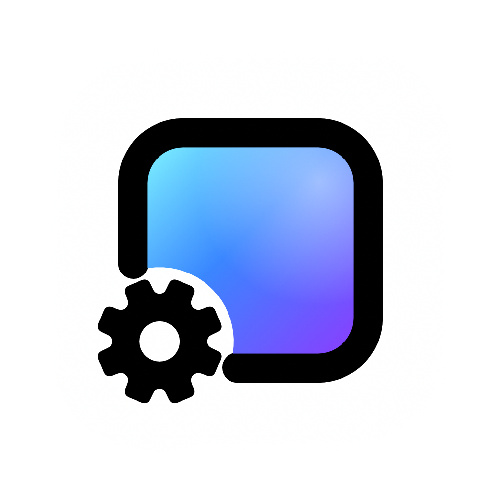

<!-- The banner is the website's share image (https://www.wallpapermachine.app/og-image.png).
     When the website changes it, update the alt text below and the artwork credit at the end. -->
<a href="https://www.wallpapermachine.app">
  
</a>

<p align="center">
  <b>Wallpaper Engine scene, video and web wallpapers, live on your Mac.</b><br>
  Browse Steam Workshop and set one per display.
</p>

<p align="center">
  <sub>macOS 26 Tahoe or later&ensp;·&ensp;Apple silicon (M1 or later)&ensp;·&ensp;Signed download coming soon</sub>
</p>

<p align="center">
  <a href="https://www.wallpapermachine.app">Website</a>&ensp;·&ensp;
  <a href="#the-app">The app</a>&ensp;·&ensp;
  <a href="#good-to-know">FAQ</a>&ensp;·&ensp;
  <a href="#open-source-free-to-build">Build it</a>&ensp;·&ensp;
  <a href="docs/README.md">Documentation</a>&ensp;·&ensp;
  <a href="#thank-you-to-every-supporter">Sponsors</a>
</p>

<br>

## The app

One window, three tabs: Discover, Installed and Settings. The website runs that
same interface on a demo library, so you can
[try it in your browser](https://www.wallpapermachine.app/#app).

| Feature | What it does |
| --- | --- |
| [**Apply**](docs/features/control-panel.md#selection-versus-apply) | Scene, video or [web](docs/features/web-wallpapers.md): press play and it becomes your desktop. Choosing a wallpaper only selects it. |
| [**Workshop**](docs/features/workshop-downloads.md) | The live Steam Workshop, no sign-in to browse. Downloads run in the app, several at once, with a Steam account that owns Wallpaper Engine. |
| [**Settings**](docs/features/control-panel.md#properties) | Every option its artist made, saved for each wallpaper when you apply your changes. |
| [**Music**](docs/features/audio-response.md) | Turn on Audio response and wallpapers made for sound move with what your Mac plays. Turn on [Media integration](docs/features/media-integration.md) and ones with a music display show the song that's on. |
| [**Displays**](docs/features/control-panel.md#target-display) | Every display gets its own wallpaper, or mirrors another, with its own scaling, frame rate and volume. |
| [**Battery**](docs/features/performance.md#battery-profile) | On battery, pause, or drop to a render scale and frame rate you choose. Both are off until you turn them on. |
| [**Native**](docs/features/appearance.md) | Light, dark and your accent colour, like the rest of macOS, in English or [简体中文](docs/features/control-panel.md#language). |
| [**Import**](docs/features/control-panel.md#downloads-and-import) | Bring the Wallpaper Engine folders you already have. The app copies them and leaves the originals alone. |
| [**Out of sight, paused**](docs/architecture.md#desktop-wallpaper-windows-and-private-api-handling) | A covered display stops its own wallpaper, and sleep or lock pauses them all. Your own pause stays yours. |
| [**Lock screen**](docs/features/lock-screen.md) | Video and scene wallpapers can animate the lock screen too. Experimental and off by default. |

## Rust core · Metal graphics

| Layer | What it does |
| --- | --- |
| **Swift shell** | The AppKit app. Its control panel is HTML in `WKWebView` ([`WebUI/`](WebUI)), and [web wallpapers](docs/features/web-wallpapers.md) run in web views of their own. |
| **Rust core** | The vendored renderer ([`upstream/renderer`](upstream/renderer)): displays, wallpaper windows, video decode and audio capture, bridged to Swift with uniffi. |
| **C++ scene engine** | Open Wallpaper Engine, statically linked into the Rust core, draws scene wallpapers. |
| **Metal, via MoltenVK** | Scenes render through Vulkan on Metal. A native Metal scene renderer and AVFoundation video are opt-in under [Settings → Performance](docs/features/performance.md). |
| **Lock screen** | A sandboxed ExtensionKit extension ([`Extension/`](Extension)). |

How the pieces talk to each other: [docs/architecture.md](docs/architecture.md).
Where each file lives: [docs/repository-layout.md](docs/repository-layout.md).

## Good to know.

A few things before your change of scenery.

<details>
<summary><b>What is WallpaperMachine?</b></summary>

WallpaperMachine is a native macOS client for Wallpaper Engine wallpapers. It
brings scene, video and web wallpapers to your desktop, with Steam Workshop
browsing and downloads built in.

</details>

<details>
<summary><b>Can I use Wallpaper Engine on a Mac?</b></summary>

Wallpaper Engine itself is made for Windows. WallpaperMachine is an independent
Mac app built to play its scene, video and web wallpapers, with Steam Workshop
browsing built in; compatibility varies by wallpaper. It is not affiliated with
Wallpaper Engine or Valve.

</details>

<details>
<summary><b>Do I need to own Wallpaper Engine?</b></summary>

You can browse the Workshop without signing in. Workshop downloads require a
Steam account that owns Wallpaper Engine, and scene wallpapers need shared
resources from a purchased Wallpaper Engine installation. The bundled video
wallpaper, Aurora Drift, plays without either. More in
[Workshop browsing and downloads](docs/features/workshop-downloads.md).

</details>

<details>
<summary><b>Which Macs is it built for?</b></summary>

Macs with Apple silicon (M1 or later) running macOS 26 Tahoe or later. Intel
Macs aren't supported.

</details>

<details>
<summary><b>Will every wallpaper work?</b></summary>

WallpaperMachine supports scene, video and web rendering. Compatibility varies
by wallpaper; support for these formats does not mean every Workshop item will
render identically, and Application wallpapers don't run. If one looks wrong,
**Report a problem on GitHub** in the inspector opens a
[GitHub issue](https://github.com/WallpaperMachine/WallpaperMachine/issues) form
with its details filled in, for you to check and send.

</details>

<details>
<summary><b>When can I get it?</b></summary>

WallpaperMachine is in development. A public download and launch date have not
been announced. The signed download will be free, and you can
[build it from the source](#open-source-free-to-build) today.

</details>

<details>
<summary><b>Is WallpaperMachine really free?</b></summary>

Yes. The signed download will be free, and the complete source is here if you
would rather build it yourself. Becoming a Supporter adds a sponsor place on the
website and in this README, plus priority support. It buys no license: the app
is the same with or without it.

</details>

## Open source. Free to build.

The complete source is here. It builds on a Mac with Apple silicon, macOS 26, a
full Xcode selected with `xcode-select` and the Homebrew packages listed under
[Prerequisites](docs/build.md#prerequisites); the renderer and scene engine are
vendored under [`upstream/`](upstream), not pulled in as submodules.

```sh
python3 scripts/install_ffmpeg.py                  # the project's LGPL FFmpeg build
python3 scripts/build.py --configuration Release   # renderer, bindings, Xcode project, app
```

The app lands in `build/Build/Products/Release/WallpaperMachine.app`.
`python3 scripts/test.py` runs the tests, and
`python3 scripts/package.py --configuration Release --install` makes the bundle
self-contained, wraps it in a disk image and copies it to `~/Applications`.
Scene wallpapers also need shared resources from a Wallpaper Engine you own.

Toolchain, packaging and troubleshooting: [docs/build.md](docs/build.md).
Working on the code: [CONTRIBUTING.md](CONTRIBUTING.md).

## Documentation

| Document | Purpose |
| --- | --- |
| [docs/README.md](docs/README.md) | Index of every document, features included |
| [docs/architecture.md](docs/architecture.md) | Runtime structure and module boundaries |
| [docs/repository-layout.md](docs/repository-layout.md) | Directory map and where new code goes |
| [CONTRIBUTING.md](CONTRIBUTING.md) | Contributor working agreement |
| [docs/testing/README.md](docs/testing/README.md) | Test strategy, commands, evidence policy |
| [docs/release.md](docs/release.md) | Versioning, release notes and the CI release pipeline |
| [CHANGELOG.md](CHANGELOG.md) | What changed in each published version |
| [LICENSING.md](LICENSING.md) | License policy, Supporter model and distribution status |
| [AGENTS.md](AGENTS.md) | Rules for agents working in this repository |

## Thank you. To every Supporter.

Supporters who choose to be shown are listed here and on the
[sponsor wall](https://www.wallpapermachine.app/sponsors/). Supporter is a
one-time purchase for a sponsor place and priority support; the app and its
source stay free for everyone.

No one is on the list yet.

## License

The source is offered under the GNU General Public License, version 2 only
([LICENSE](LICENSE)). The vendored renderer is GPL-2.0-only and the app shell is
derived from it; upstream code keeps its own copyright and license notices,
recorded in [upstream/provenance.json](upstream/provenance.json). Every recipient
keeps every right the GPL grants, whether or not they are a Supporter.

**No binary is cleared for distribution yet.** Apache-2.0 components (MoltenVK,
the Vulkan loader, SPIRV-Tools, parts of glslang and the vendored spirv_reflect)
are in every build's link closure and are not compatible with GPLv2.
[LICENSING.md](LICENSING.md) records the policy, the Supporter model, each
component's license, the open blockers and what would resolve them. Workshop
wallpapers belong to their creators, and scene resources come from a Wallpaper
Engine you own; the app bundles neither.

<br>

<p align="center">
  
</p>

<p align="center">
  <b>A new view.</b><br>
  Coming to your Mac.
</p>

<p align="center">
  <sub>
    Made for a more personal Mac.<br>
    An independent project. Not affiliated with Wallpaper Engine or Valve.<br>
    Banner artwork: <a href="https://steamcommunity.com/sharedfiles/filedetails/?id=3632513108">千咲 · 不散的春之花</a> by 夜莺Night, Wuthering Waves artwork. All artwork rights remain with their owners.
  </sub>
</p>
