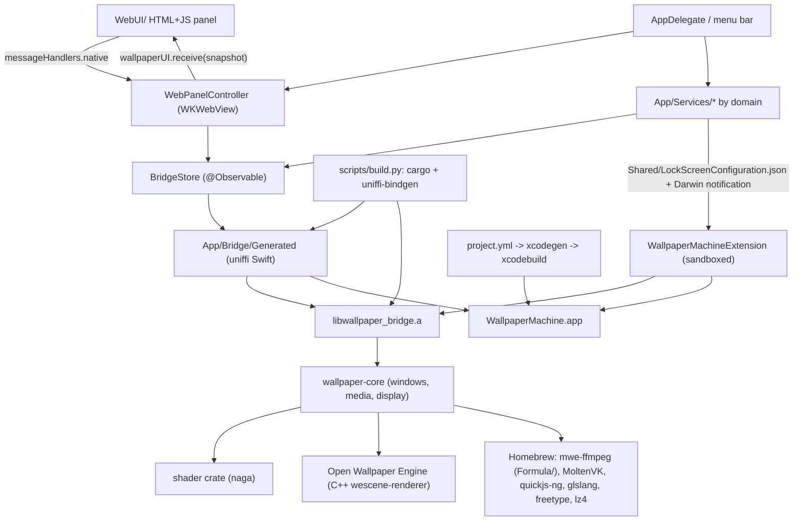

# Architecture

WallpaperMachine is a native macOS wallpaper client built on a vendored Rust/C++ renderer.
It ships as one application bundle that embeds one ExtensionKit extension, and it links a Rust
static library that in turn statically links a C++ scene renderer.

For the directory map and where new code belongs, see [repository-layout.md](repository-layout.md).

This document is long because it spans four runtimes. Read the section you need
rather than the whole file:

| Section | Read it when |
|---|---|
| [Layers](#layers) | Orienting for the first time; each subsection below stands alone |
|  [AppKit shell](#appkit-shell) | Touching app startup, windows or the status item |
|  [Control panel: WKWebView and the JavaScript bridge](#control-panel-wkwebview-and-the-javascript-bridge) | Changing `WebUI/`, the message bridge, CSP or asset allowlisting |
|  [Observable state](#observable-state) | Adding state that views or the panel observe |
|  [Service layer](#service-layer) | Adding domain logic, networking or persistence under `App/Services/` |
|  [Desktop wallpaper windows and private-API handling](#desktop-wallpaper-windows-and-private-api-handling) | Working on wallpaper presentation, Spaces or displays |
|  [Renderer bridge (generated uniffi)](#renderer-bridge-generated-uniffi) | Changing the Swift↔Rust boundary or regenerating bindings |
|  [Rust crates and the C++ scene engine](#rust-crates-and-the-c-scene-engine) | Working inside `upstream/renderer` |
|  [Lock-screen extension](#lock-screen-extension) | Touching `Extension/` or `Shared/` |
| [Build-time dependency chain](#build-time-dependency-chain) | A build fails or you add a dependency |
| [Ours versus vendored](#ours-versus-vendored) | Deciding whether a change belongs in `upstream/` |
| [Homebrew linkage and bundling](#homebrew-linkage-and-bundling) | Diagnosing dylib, rpath or packaging problems |
| [Targets](#targets) | Adding a target or moving a file between them |
| [Runtime and build relationships](#runtime-and-build-relationships) | Tracing what talks to what at runtime |
| [Invariants and constraints](#invariants-and-constraints) | Before changing anything structural — these are the rules |
| [Where to look](#where-to-look) | You know the symptom but not the file |

## Layers

### AppKit shell

`App/WallpaperEngineApp.swift` is the `@main` entry point. It is plain AppKit: it creates
`NSApplication`, installs `AppDelegate`, and runs the loop — there is no SwiftUI `App` scene.

`App/AppDelegate.swift` owns process lifecycle: it configures the Vulkan ICD
(`App/Bridge/BridgeEnvironment.swift` points `VK_ICD_FILENAMES` at the bundled
`MoltenVK_icd.json`), prepares the app-support tree (`ClientPaths.prepare()`), constructs
`BridgeStore`, installs the menu-bar status item and application menu, observes
`NSApplication.didChangeScreenParametersNotification`, opens the control-panel window, and
drives an ordered asynchronous shutdown (lock screen, desktop poster sync, SteamCMD setup,
downloader, then the renderer bridge). The app runs in `.accessory` activation policy while no
control-panel window is visible and switches to `.regular` when one is. Under a hosted test run
(`NSClassFromString("XCTestCase") != nil`) the delegate short-circuits: no services are created
against the user's real app-support folder.

### Control panel: WKWebView and the JavaScript bridge

The control-panel UI is HTML/CSS/JS in `WebUI/`, bundled as the app resource folder `WebUI`.
Swift hosts it, but the page is app-owned: the renderer never draws into this web view.

| Piece | Responsibility |
|---|---|
| `App/Views/ControlPanel/ControlPanelView.swift` | SwiftUI container; `ControlPanelNavigation` (`SidebarSelection`, `targetDisplayID`, Settings section) shared with native menu commands |
| `App/Views/ControlPanel/WebControlPanel.swift` | `NSViewRepresentable` over `WKWebView`; `WebPanelController` coordinator, `WebPanelAssets` scheme handler, message proxy |
| `App/Views/ControlPanel/WebPanelSnapshot.swift` | Builds the single `[String: Any]` state payload handed to the page |
| `App/Views/ControlPanel/WebPanelActions.swift` | Decodes and executes page-originated actions (`WebPanelRequest`) |
| `WebUI/index.html`, `panel.js`, `settings.js`, `welcome.js`, `theme.js`, `panel.css`, `settings.css`, `welcome.css` | The page itself; `welcome.js` is the full-window first-run guide |
| `WebUI/icons.js` | Vendored [Lucide](https://lucide.dev) glyphs (ISC) behind the page's `icon(name)` helper |

Protocol, both directions:

- **Assets.** `WebPanelAssets` is a `WKURLSchemeHandler` for the private `mwe-ui` scheme. The
  page loads from `mwe-ui://app/index.html`, and only the six known file names are served.
  Wallpaper previews are served as `mwe-ui://preview/<wallpaperID>` from a per-snapshot allow
  list, so no library path is exposed to the page. `index.html` additionally carries a
  restrictive CSP (`default-src 'none'`, `connect-src 'none'`).
- **Swift to page.** `WebPanelController.snapshot()` produces one dictionary describing the whole
  UI (page, library, displays, options, settings, workshop, SteamCMD setup, downloads, import
  status, theme, GitHub update state), delivered by `callAsyncJavaScript("return window.wallpaperUI.receive(state)")`.
  Updates are coalesced through `scheduleUpdate()` and suppressed entirely while the window is
  hidden, miniaturized or occluded. Observation is installed with
  `withObservationTracking { trackSnapshotDependencies() }`, so any observed store property that
  the snapshot reads re-arms an update.
- **Page to Swift.** `panel.js` calls `window.webkit.messageHandlers.native` with an `action`
  string plus arguments. The handler is a `WKScriptMessageHandlerWithReply`, so every action is
  answered with either a fresh snapshot or an error string. `WebPanelController.receive` rejects
  any message that is not from the main frame of the `mwe-ui://app` origin.
- **Theme.** `theme.js` reads `window.__appTheme`, injected as the panel's only `WKUserScript` at
  document start so the resolved appearance is correct before first paint;
  `window.appTheme.apply(theme)` is called on every snapshot.
- **Recovery.** `webViewWebContentProcessDidTerminate` reloads the page once, then surfaces a
  native `NSAlert` with a Reload action. Navigation policy allows only the index URL; external
  links are filtered by `WebPanelController.allowedExternalURL`.

### Observable state

`App/ViewModels/BridgeStore.swift` is the `@MainActor @Observable` facade over the renderer. It
holds the `WallpaperBridge` handle and the cached snapshot values (`appSnapshot`,
`librarySnapshot`, `wallpaperOptionsSnapshot`, `monitorInformationSnapshot`, `settingsSnapshot`,
`snapshotRevision`, `libraryLoadState`), exposes async mutation calls, and publishes
`onSnapshotApplied` so `AppDelegate` can re-evaluate presentation policy and lock-screen state.
`App/ViewModels/WallpaperEditorState.swift` holds transient editor drafts (scaling text,
property text, expanded sections) that must not be pushed into the renderer on every keystroke.
`App/Logging/AppLog.swift` forwards Swift log lines into the Rust log channel via the store.

### Service layer

Services are grouped by domain under `App/Services/`.

| Domain | Types | Responsibility |
|---|---|---|
| `Appearance/` | `AppTheme` (`AppThemePreferences`, `AppThemeStore`) | Mode/accent/tone preferences shared by AppKit and the page |
| `Desktop/` | `DesktopSpaceWallpaperAPI`, `DesktopWallpaperLedger`, `DesktopWallpaperSync`, `WallpaperPresentationPolicy` | Per-Space desktop picture control, original-wallpaper journal, still-poster sync, per-display renderer suspension |
| `GitHub/` | `GitHubReleaseClient`, `AppUpdateModels`, `AppUpdateStore`, `AppUpdateInstaller` | GitHub Releases update check, download, in-place install |
| `Library/` | `ClientPaths`, `WallpaperImportService`, `WallpaperDeletionService` | App-support layout, non-destructive import, guarded deletion |
| `LockScreen/` | `LockScreenWallpaperSelection`, `LockScreenWallpaperService` | System lock-screen selection overrides and configuration publishing |
| `Steam/` | `SteamCMDRuntime`, `SteamCMDSetupStore` | SteamCMD discovery, download, validation, security approval |
| `Workshop/` | `WorkshopService`, `WorkshopStore`, `WorkshopDownloader`, `WorkshopDownloadManager`, `WorkshopThumbnailCache` | Workshop query model, browse state, SteamCMD-driven downloads, concurrent download queue sharing one saved sign-in, one-download on-disk previews (still + animation) for Discover tiles, warmed ahead of the panel |
| `WebWallpaper/` | `WebWallpaperHost`, `WebWallpaperWindow`, `WebWallpaperPage` | Desktop-level `WKWebView` windows for `type: "web"` projects, driven by the bridge's `webWallpapers()`; see [features/web-wallpapers.md](features/web-wallpapers.md) |

`ClientPaths` fixes the on-disk contract: everything lives under
`~/Library/Application Support/WallpaperMachine` (overridable with
`WALLPAPER_MACHINE_HOME`) with `Library/`, `SceneAssets/`, `SteamCMD/` beneath it, and it
exports `WALLPAPER_MACHINE_SUPPORT_ROOT`, `_LIBRARY_ROOT` and `_ASSETS_ROOT` so the Rust side
resolves the same paths.

### Desktop wallpaper windows and private-API handling

Live desktop wallpaper windows for scene and video projects are created by the Rust core, not
by Swift: `upstream/renderer/crates/core/src/window.rs` defines the `NSWindow` subclass
`MWEWallpaperDesktopWindow` (stable Objective-C name, deliberately depended on by Swift) hosting
a `CAMetalLayer` at a wallpaper window level. Web projects get the same window shape from Swift
(`MWEWebWallpaperDesktopWindow`, `App/Services/WebWallpaper/`); the bridge excludes them from
engine reconciliation and reports them through `webWallpapers()`.

Swift keeps the *system* wallpaper consistent with that window:

- `DesktopSpaceWallpaperAPI` `dlopen`s CoreGraphics and HIServices and resolves
  `_CGSDefaultConnection`, `CGSCopyManagedDisplaySpaces`, `DesktopPictureCopyDisplayForSpace` and
  `DesktopPictureSetDisplayForSpace`. Every symbol is optional: the initializer fails and the
  caller falls back to the public `NSWorkspace` API, which is scoped to the visible Space.
- `DesktopWallpaperLedger` journals the user's original per-Space `DesktopPicture` (including the
  opaque native options blob) before anything is replaced, so the original wallpaper can be
  restored.
- `DesktopWallpaperSync` encodes real renderer output into a PNG poster
  (`DesktopPosterEncoder`) under `<support>/DesktopPosters`, so the static system wallpaper
  matches the animated one; it suspends itself while the native lock-screen provider owns the
  desktop.
- `WallpaperPresentationPolicy` suspends presentation when no wallpaper pixel can reach a
  display, without altering the user's play/pause choice. Display sleep and session lock are
  global conditions and use `setPresentationSuspended`; occlusion is per display and uses
  `setDisplayPresentationSuspended`, so one covered screen stops only its own decoding,
  simulation and rendering and a visible screen never resumes a covered one. The bridge keeps
  `suspended_displays` beside the global flag, resolves each scene's and web descriptor's paused
  state from its own display, and re-applies the still-hidden displays after a global resume.
  System audio capture follows visible consumers — a presenting scene with audio response
  enabled — rather than the global pause flag.

### Renderer bridge (generated uniffi)

`App/Bridge/Generated/` holds `WallpaperBridge.swift`, `WallpaperBridgeFFI.h` and
`WallpaperBridgeFFI.modulemap`, generated by `uniffi-bindgen` from the Rust
`wallpaper-bridge` crate. Swift sees a `WallpaperBridge` object plus the `Bridge*` value types
(`BridgeAppSnapshot`, `BridgeLibrarySnapshot`, `BridgeSettingsSnapshot`,
`BridgeWallpaperOptionsSnapshot`, `BridgeMonitorInformationSnapshot`, `BridgePropertyDescriptor`,
`BridgeScalingMode`, `BridgeLockScreenScene`, `BridgeError`, …). The `WallpaperMachine` and
`WallpaperMachineTests` targets consume it through `SWIFT_INCLUDE_PATHS`,
`HEADER_SEARCH_PATHS` and `-Xcc -fmodule-map-file=…/WallpaperBridgeFFI.modulemap`; the two
generated FFI files are excluded from the compile sources list and reached through the module map
instead.

### Rust crates and the C++ scene engine

`upstream/renderer` is a Cargo workspace (`resolver = "2"`, edition 2024, GPL-2.0-only) with
three members:

| Crate | Output | Role |
|---|---|---|
| `crates/bridge` (`wallpaper-bridge`, lib name `wallpaper_bridge`) | `staticlib` + `rlib`, plus the `uniffi-bindgen` binary | uniffi API surface (`api/`), kameo actor (`actor/`), engine facade (`engine/`), config store, library scanner, display rows, logging, login item, power |
| `crates/core` (`wallpaper-core`) | `rlib` | Runtime state machine: scene reconciliation, display discovery and watching, wallpaper windows, media decode (`media/video`, `media/audio` capture for audio response), render cache, and the `owe` FFI wrappers |
| `crates/shader` (`shader`) | `rlib` + `staticlib` | GLSL parsing/translation via `naga`, exposed to C++ through the `ffi` feature |

`crates/core/build.rs` drives the C++ layer: it runs `bindgen` over
`upstream/renderer/external/open-wallpaper-engine/src/Platform/Apple/SceneWallpaperBindings.h`,
then CMake-builds the `wescene-renderer` target of Open Wallpaper Engine with `BUILD_TESTING`
and `BUILD_TESTS` off and `RUST_SHADER_FFI` on, and emits the
static link flags. Open Wallpaper Engine stays a statically linked renderer backend: its Rust
wrapper module (`core/src/owe/`) must not own scene registries or display maps.

Pointer polling follows committed native scene capability, not a manifest or a
first-frame notification. Pure video projects publish no pointer consumer;
ordinary and not-yet-committed scenes remain conservative. A bounded, event-driven
relay carries a retained renderer-instance identity into the core actor. Snapshot
publication serializes consumer notifications with button-edge activation, while
the bridge combines consumer presence with pause policy for its existing 16 ms,
single-in-flight poller. One sample delivers enter, position and ordered button
transitions in one actor turn. Successful identical position/enter writes are
deduplicated; native per-frame camera/content mapping and hit dispatch still run.
A level-only button baseline reconciles a newly committed consumer without
inventing presses or replaying video-period taps. These are Rust/native runtime
contracts, not persisted or uniffi snapshot fields.

### Lock-screen extension

`Extension/` builds `WallpaperMachineExtension`, an `extensionkit-extension` target for the
`com.apple.wallpaper` extension point (`Extension/Info.plist`). It is a separate, sandboxed
process; the app cannot call into it directly.

| File | Responsibility |
|---|---|
| `WallpaperExtension.swift` | `@main AppExtension`; XPC handler for `acquire`/`update`/`invalidate`/`snapshot`/`provideSettingsViewModels`/`isChoiceDownloaded`/`selectedChoicesDidChange`, and connection acceptance |
| `WallpaperRuntime.swift` | Loads and checks the private hosting ABI, verifies the caller's code signature via its audit token, resolves `CAContext`, reads the published configuration and asset paths, logging |
| `WallpaperController.swift` | Singleton surface registry; reacts to screen sleep/wake, `com.apple.screenIsLocked`/`Unlocked`, and the Darwin notification `app.wallpapermachine.lock-screen.changed` |
| `WallpaperSurface.swift` | One `WallpaperID` to one `CAContext`/`CAMetalLayer` surface with bounded dimensions, first-frame and snapshot waiters |
| `WallpaperSettingsProvider.swift` | Encodes the private wallpaper settings view-model payload |
| `WallpaperExtensionBridge.h` | Objective-C bridging header declaring the private `CAContext`, `NSXPCConnection.auditToken` and the XPC protocol; also includes `SceneWallpaperBindings.h` |

The process boundary is a file boundary. `Shared/` compiles into both targets and holds the
contracts they must agree on: `RuntimeCounters` (time-limited, per-surface runtime counters for
power work, off by default — see [testing/power-benchmark.md](testing/power-benchmark.md)),
`WallpaperPresentationAuthority` (which surface roles may keep presenting, and why not, so a
preview or lock-screen instance cannot render for nobody), and
`LockScreenConfiguration`, which defines the published contract: the app writes a complete immutable
`LockScreenConfiguration` (version, revision, `[LockScreenScene]` with paths relative to the
extension's Documents directory) into the extension container, then posts
`LockScreenConfiguration.changedNotification`; the extension reloads and writes
`LockScreenReadiness` back only after a GPU-ready non-preview surface exists. The extension
never reads draft options or the app's private configuration files, and it publishes no
external URLs. `Extension/WallpaperExtension.entitlements` enables the App Sandbox with a single
read-only exception for `/opt/homebrew/`, which is what lets the sandboxed process load the
Homebrew-provided renderer dylibs.

See [features/lock-screen.md](features/lock-screen.md) for the user-facing behaviour.

## Build-time dependency chain

`scripts/build.py` is the whole chain. It builds a Homebrew-rooted environment
(`CMAKE_PREFIX_PATH`, `PKG_CONFIG_PATH`, `OWE_NIX_LIBRARY_PATH`, `LIBCLANG_PATH`, `SDKROOT`,
`CC`/`CXX`, `MACOSX_DEPLOYMENT_TARGET=26.0`, `GIT_SHORT_COMMIT`), then:

1. `cargo build --workspace --release` in `upstream/renderer` — which also bindgen-generates the
   Open Wallpaper Engine bindings and CMake-builds `wescene-renderer` — producing
   `upstream/renderer/target/release/libwallpaper_bridge.a` and the `uniffi-bindgen` binary.
2. `uniffi-bindgen generate --library target/release/libwallpaper_bridge.a --language swift
   --no-format` into `App/Bridge/Generated`.
3. `xcodegen generate` to regenerate `WallpaperMachine.xcodeproj` from `project.yml`.
4. `xcodebuild -scheme WallpaperMachine -derivedDataPath build`, producing
   `build/Build/Products/<Configuration>/WallpaperMachine.app`.

`--renderer-only` stops after step 2; `--swift-only` skips steps 1–2. See
[build.md](build.md) for the full toolchain and [testing/README.md](testing/README.md) for what
verification runs.

## Ours versus vendored

| Path | Origin |
|---|---|
| `App/`, `Extension/`, `Shared/`, `WebUI/`, `Tests/`, `scripts/`, `Formula/`, `project.yml` | This project, GPL-2.0-only (root `LICENSE`); `App/` is a derived work of the renderer's former `app/WallpaperEngine` |
| `App/Bridge/Generated/` | Build output of the vendored bridge crate |
| `upstream/renderer/` | Fork of `bigsaltyfishes/wallpaper-engine-for-macos`, GPL-2.0-only, modified |
| `upstream/renderer/external/open-wallpaper-engine/` | Fork of `bigsaltyfishes/open-wallpaper-engine`, modified; vendors Apache-2.0 `spirv_reflect` and public-domain/MIT-0 `miniaudio` under `third_party/` |
| `upstream/mediaremote-adapter/` | `ungive/mediaremote-adapter`, BSD-3-Clause, unmodified |

`upstream/provenance.json` records the repositories, pinned revisions, modification status and
the current `distributionStatus`. `scripts/package.py` copies the root `LICENSE`, `LICENSING.md`,
`upstream/renderer/LICENSE` (as `Renderer-LICENSE.txt`), `upstream/provenance.json` and every
bundled keg's notices into the bundle's Resources ([build.md](build.md#packaging-and-installing)).
Licence policy, the sales model and the open distribution blockers live in
[../LICENSING.md](../LICENSING.md). The Workshop browser is recorded there and in the provenance
file as independently implemented.

## Homebrew linkage and bundling

Both the app and the extension link the same renderer flag set (`project.yml` anchors
`rendererLibraryPaths` and `rendererLinkerFlags`): `-lwallpaper_bridge` plus `-lc++`,
`-lvulkan`, `-llz4`, `-lfreetype`, the FFmpeg family (`-lavformat -lavcodec -lavutil
-lswresample -lavfilter -lavdevice -lswscale`), `-lqjs` (quickjs-ng), `-lglslang`, `-lSPIRV`,
`-lglslang-default-resource-limits`, `-liconv`, and the system frameworks (Metal, QuartzCore,
CoreAudio, CoreVideo, VideoToolbox, IOSurface, …). Library search paths point at
`upstream/renderer/target/release`, `/opt/homebrew/lib`, and the `mwe-ffmpeg`, `quickjs-ng` and
`glslang` opt prefixes. The FFmpeg libraries come from `Formula/mwe-ffmpeg.rb`, not Homebrew's
GPLv3 `ffmpeg@8`; `libSPIRV` in turn loads Apache-2.0 SPIRV-Tools, and `libvulkan` opens the
Apache-2.0 MoltenVK ICD, which is why the bundle is not distributable
([../LICENSING.md](../LICENSING.md#remaining-blockers)).

A freshly built app therefore still depends on Homebrew. `scripts/package.py` makes the bundle
self-contained: after a preflight that refuses an already-packaged bundle, non-LGPL FFmpeg
libraries and a missing notice, it copies `libMoltenVK.dylib` and, transitively, every
Homebrew-prefixed dependency of the app binary, the `.appex` binaries and the copied dylibs into
`Contents/Frameworks`; rewrites install names and `-change` entries to `@rpath/<name>`; deletes
Homebrew and source-tree `LC_RPATH` entries and adds `@executable_path/../Frameworks`
(`@executable_path/../../../../Frameworks` for extension binaries); writes a `MoltenVK_icd.json`
next to both the app and each extension pointing at the bundled driver; writes the license
payload; ad-hoc signs the dylibs, each extension (preserving entitlements) and the app (no
Developer ID, no notarization); verifies with `codesign --verify --deep --strict`; fails if any
dependency is still unbundled; and zips `WallpaperMachine-<version>-arm64.zip`, labelled as
not cleared for distribution.

## Targets

| Target | Type | Sources | Notes |
|---|---|---|---|
| `WallpaperMachine` | application | `App/`, `Shared/`, `Resources/StarterWallpaper` and `WebUI` as resource folders | Embeds the extension; uses `App/Resources/Info.plist` verbatim |
| `WallpaperMachineExtension` | extensionkit-extension | `Extension/`, `Shared/`, the starter preview image | Sandboxed, `APPLICATION_EXTENSION_API_ONLY`, Objective-C bridging header |
| `WallpaperMachineTests` | bundle.unit-test | `Tests/Unit/` | Hosted in the app binary (`TEST_HOST`/`BUNDLE_LOADER`) |
| `WallpaperMachineUITests` | bundle.ui-testing | `Tests/UI/` | Separate runner, `TEST_TARGET_NAME: WallpaperMachine` |

Schemes: `WallpaperMachine` (run + unit tests) and `WallpaperMachineUI` (UI tests).

## Runtime and build relationships

## Invariants and constraints

- `project.yml` is the single source of truth for targets, settings, versions and schemes.
  `WallpaperMachine.xcodeproj` is regenerated by `xcodegen generate`; never edit the
  `.pbxproj` by hand.
- `App/Bridge/Generated/` is build output. Regenerate it through `scripts/build.py`; hand edits
  are lost on the next build.
- `Shared/` compiles into both targets, so it must build under `APPLICATION_EXTENSION_API_ONLY`
  and must contain only the app/extension contract.
- The extension is sandboxed and API-extension-only. Its only inputs are the published
  `configuration.json`, the assets it can read under its own Documents directory, and its single
  read-only Homebrew exception. It never reads draft state or app-private files.
- The extension accepts an XPC connection only after verifying the caller's code signature, and
  every private-ABI assumption is checked against the loaded system classes — no fallback
  offsets, no process injection, no lock-screen window impersonation.
- Private desktop/Space APIs are resolved with `dlsym` and are always optional: failure falls
  back to the public `NSWorkspace` API.
- The user's original wallpaper is journalled before replacement, and the lock-screen selection
  edits only explicit per-display overrides.
- The control panel's web view loads only `mwe-ui://app/index.html` from the bundle; renderer
  content is never loaded into it, and page messages are accepted only from that origin's main
  frame.
- Snapshot updates are suppressed while the panel is not visible; the page receives whole
  snapshots, never partial mutations.
- Versions (`MARKETING_VERSION`, `CURRENT_PROJECT_VERSION`) are bumped through
  `scripts/bump_version.py` so `project.yml` and the generated project stay in step.

## Where to look

| Concern | Location |
|---|---|
| App lifecycle, menus, shutdown order | `App/WallpaperEngineApp.swift`, `App/AppDelegate.swift` |
| Control-panel hosting and the JS bridge | `App/Views/ControlPanel/` |
| Panel markup, styles and behaviour | `WebUI/` |
| Observable renderer state | `App/ViewModels/` |
| Domain logic | `App/Services/<Domain>/` |
| Generated Rust bridge | `App/Bridge/Generated/` |
| Lock-screen extension | `Extension/`, `Shared/LockScreenConfiguration.swift` |
| Renderer, scene engine, shaders | `upstream/renderer/crates/`, `upstream/renderer/external/open-wallpaper-engine/` |
| Targets, linker flags, versions | `project.yml` |
| Build, test and packaging commands | `scripts/` |
| Directory map and placement rules | [repository-layout.md](repository-layout.md) |
